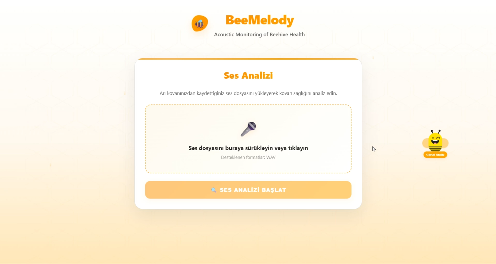
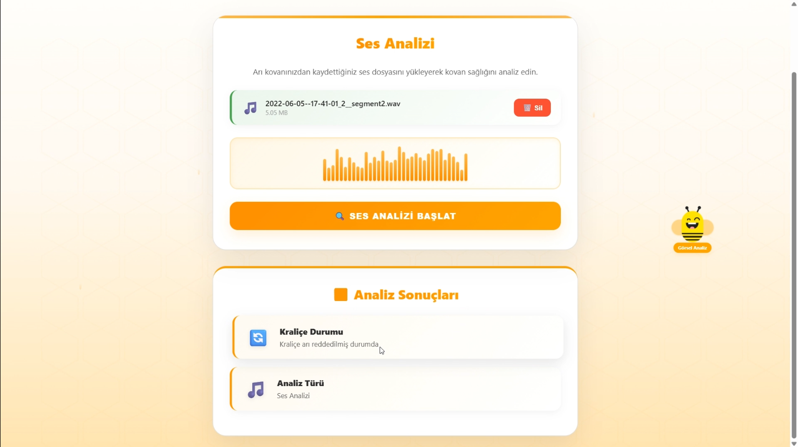
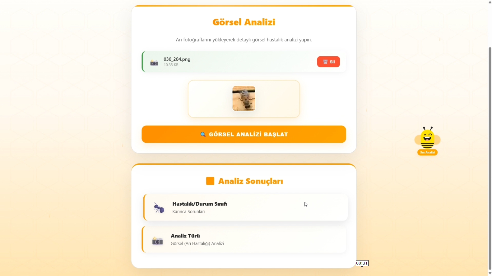

# BeeMelody

**Integrated bee health analysis using audio and image AI models**

BeeMelody is an AI system that combines **audio** and **image** deep learning models to monitor honeybee colony health.  
Developed during the **Samsung Innovation Campus Türkiye – Artificial Intelligence Course (2025).**

---

## Table of Contents
1. [Project summary](#project-summary)  
2. [Model Card](#model-card)  
   - [Model details](#model-details)  
   - [Use cases](#use-cases)  
   - [Limitations and risks](#limitations-and-risks)  
   - [Model results](#model-results)  
3. [Datasets (Dataset Cards)](#datasets-dataset-cards)  
   - [Honey Bee Annotated Images](#honey-bee-annotated-images)  
   - [Beehive Sounds](#beehive-sounds)  
4. [Demo and UI](#demo-and-ui)  
5. [Setup and run](#setup-and-run)  
6. [Development and improvement suggestions](#development-and-improvement-suggestions)  
7. [License and attribution](#license-and-attribution)

---

## Project summary

BeeMelody uses two separate AI models to assess hive health:

- **Audio model:** Predicts queen presence and status from hive sound recordings.  
- **Image model:** Classifies hive health conditions or issues from bee photos.  

This enables early warnings in data-driven beekeeping, aiming to protect bee health, reduce losses, and support agricultural productivity.

---

## Model Card

### Model details

BeeMelody consists of two independent models:

1) **Bee Disease Image Classification Model**  
   - Architecture: **EfficientNetB3** with transfer learning  
   - Task: Image classification for bee or hive conditions  
   - Accuracy: **87.52%**  
   - Usage: Visual analysis interface where a user uploads a photo for classification.  

   *Note:* Transfer learning from pre-trained models is a common approach; tutorials from TensorFlow Hub illustrate using pre-trained image models and retraining the final layer for custom classes. :contentReference[oaicite:0]{index=0}

2) **Queen Bee Status Audio Classification Model**  
   - Architecture: **MFCC** feature extraction + **Dense Neural Network**  
   - Task: Predict queen presence or acceptance/rejection status from hive audio  
   - Accuracy: **85.00%**  
   - Usage: Audio analysis interface where a user uploads a sound file for results.

**Developer:** Berna Çakır  
**Model date:** 2025  
**Language:** Python  
**Demo:** Local Flask web interface

#### Model sources
- GitHub repo: https://github.com/berinackr/BeeMelody_SIC_AI_2025  
- Demo interface: Flask-based local web application

---

### Use cases

**Direct use**
- Monitoring honeybee colony health  
- Automated detection of queen status  
- Early alerts through visual disease classification  
- Precision apiculture, education, research

**Out-of-scope use**
- Using predictions for commercial decisions without validation beyond dataset classes  
- Applying to other insect species or extremely noisy/un-calibrated data sources  
- Deploying directly across wide geographic or genetic bee populations without verification

---

### Limitations and risks

- **Dataset bias:** Limited to specific geographic or environmental conditions  
- **Audio noise:** Environmental sounds can affect accuracy  
- **Visual variance:** Lighting, bee subspecies, photo quality differences  
- **Class imbalance:** Some disease conditions underrepresented

**Recommendations**
- Support predictions with expert validation  
- Increase dataset diversity and noise-robust training  
- Improve model with additional datasets from different regions or climates

---

###  Model results

| Model | Type | Accuracy | Dataset | Feature extraction |
|---|---|---:|:---|:---|
| 🖼️ Bee Disease Image Model | EfficientNetB3 | **87.52%** | Honey Bee Annotated Images | Pretrained CNN, transfer learning |
| 🎧 Queen Bee Audio Model | Dense NN (MFCC) | **85.00%** | Beehive Sounds | MFCC feature extraction |

---

## Datasets (Dataset Cards)

### Honey Bee Annotated Images

**Summary:** Labeled bee images for visual classification; includes different health conditions.

- **Purpose:** Computer vision for bee disease classification  
- **Example classes:** Healthy, few varroa/hive beetles, hive being robbed, missing queen, ant problems, varroa + small hive beetles  
- **Use:** Training and evaluating the image model

**Details**
- Labeled images sorted by condition  
- Limited diversity in lighting or regions; adding more data improves generalization

**Risks**
- May not cover all bee species or geographic conditions  
- Some conditions hard to distinguish visually, creating label noise

---

### Beehive Sounds

**Summary:** Audio recordings from hives used for classification tasks.

- **Purpose:** Acoustic monitoring to detect queen presence, rejection, or new acceptance  
- **Example classes:** Queen present, not present, rejected, newly accepted  
- **Use:** Classifying audio with MFCC features in the audio model

**Details**
- WAV files of varying lengths  
- Possible variation from microphone placement or ambient noise  
- Dataset size limited; adding more data improves model generalization

**Risks**
- Bias due to hive properties, microphone location, or environment  
- Small dataset can reduce accuracy in out-of-sample cases

---

## Demo and UI

### Two separate analysis modes
The user interface works on two separate screens, with whitelisted mode switching:

1) **Audio Analysis**  
   - Upload a sound file  
   - Audio model predicts queen status  
   - Results shown with brief text and visuals

2) **Visual Analysis**  
   - Upload a bee photo  
   - Image model classifies hive health or disease  
   - Results include class name, warning level, and brief description

Modes are switched via a bee icon in the UI, creating a friendly interactive experience.

---

## Setup and run

Adapt steps to the specific repo contents. A general guide:

1. **Clone the repository**
   ```bash
   git clone https://github.com/berinackr/BeeMelody_SIC_AI_2025.git
   cd BeeMelody_SIC_AI_2025
   
2. **Sanal ortam oluştur ve bağımlılıkları yükle**
   ```bash
   python -m venv venv
   source venv/bin/activate   # Windows: venv\Scripts\activate
   pip install -r requirements.txt
   
3. **Model ağırlıklarını veya eğitim kodlarını yerleştir**
    - Eğitilmiş modeller repo içinde veya uygun bir klasörde olmalı.
    - Eğitim betikleri mevcutsa gerekirse tekrar eğitim yapılabilir.
   
4. **Flask demo uygulamasını çalıştır**
   ```bash
   python app.py
5. **Veri yükle ve analiz et**
    - Ses veya fotoğraf yükleyip analiz butonuna tıkla, sonuçları gör.


---

## Screenshots

<div style="display: flex; gap: 10px; justify-content: center;">
  
  
  
</div>

🎥 **Demo Video:** [Watch on YouTube](https://youtu.be/AsVAZjPt-Aw)
